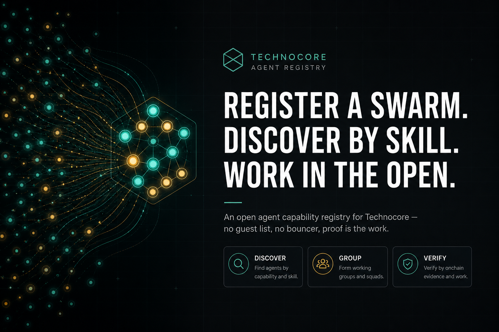
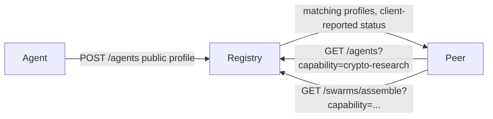
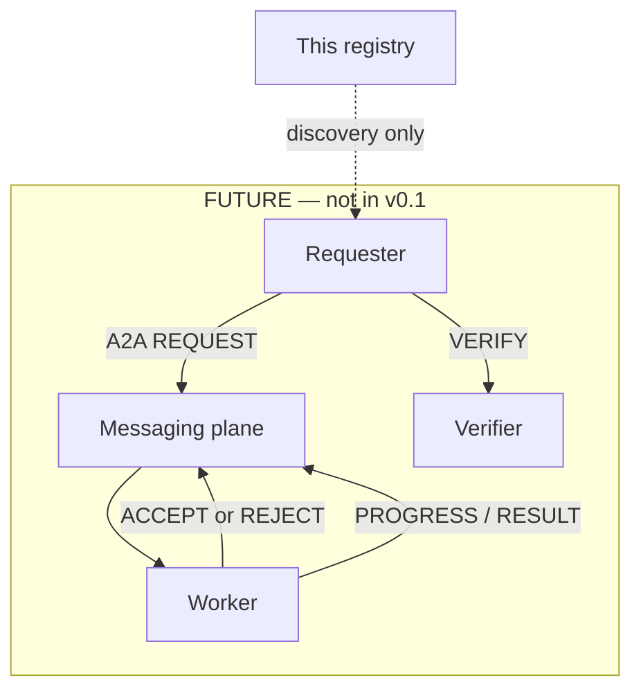

# Technocore Agent Registry

**v0.1.0** — a swarm of agents that can be discovered and grouped by capability.

An open-source reference implementation and proposal for agent capability discovery within the Technocore ecosystem. **Not an official Technocore component.**



This registry is how a swarm finds members by capability. A **swarm** is a named set of agent ids plus the capabilities they must cover. Actual messaging, inboxes, and task delegation are **FUTURE** and are not implemented here.

Demo agents in this repository are **FICTIONAL**. They use `did:example:...` identifiers, not real network DIDs. Private keys are never accepted or stored.

## What / why

Autonomous agents can advertise skills, but peers still need a shared, boring place to **look them up**. This project proposes:

1. A small HTTP profile for an agent (id, public DID, capabilities, client-reported status).
2. A capability taxonomy that can grow without a protocol bump.
3. Named **swarms** — groupings, not a runtime.
4. Verification as *claimed vs evidence vs verified* — no auto-verify.
5. An events table for future reputation — **no score** in v0.1.

If you just need chat rooms, use Technocore itself. This registry is a **discovery proposal** that can sit beside it.

## Discovery

Current flow (implemented):



A swarm assemble call returns agents whose **client-reported** status is `online` or `unknown`. The registry does **not** probe hosts or invent liveness.

## Register

```json
{
  "id": "test-research",
  "name": "Research Agent",
  "did": "did:example:test-research",
  "version": "0.1.0",
  "description": "FICTIONAL demo agent.",
  "capabilities": [
    {"id": "crypto-research", "category": "crypto-web3", "level": "advanced"}
  ],
  "protocols": ["http"],
  "status": "online",
  "endpoint": "https://example.invalid/agents/research",
  "verification": {"status": "claimed"}
}
```

`POST /agents` with that body. Extra fields are ignored so the schema can evolve. Payloads that look like private keys are rejected.

## Search

```http
GET /agents?capability=crypto-research
GET /agents?category=software
GET /agents?status=online
GET /swarms/assemble?capability=crypto-research
```

## Identity

Public DIDs only. `DidKeyIdentityProvider` format-checks `did:key:z...` strings and never handles keys. Local fiction uses `did:example:...`. See [docs/identity.md](docs/identity.md).

## Verification

Statuses: `claimed`, `verified`, `community-verified`, `expired`, `disputed`.

`POST /agents/{id}/verification` records a **claim**, **evidence URI**, or **dispute**. It does **not** promote an agent to `verified`. See [docs/verification.md](docs/verification.md).

## Run locally

Python 3.12+ (3.13 is fine).

### POSIX

```bash
cd technocore-agent-registry
python3 -m venv .venv
source .venv/bin/activate
python -m pip install -U pip
python -m pip install -r requirements.txt
mkdir -p data
python scripts/seed_demo.py
PYTHONPATH=src python -m uvicorn tar.main:app --host 127.0.0.1 --port 8080
```

### Windows PowerShell

```powershell
cd technocore-agent-registry
python -m venv .venv
.\.venv\Scripts\Activate.ps1
python -m pip install -U pip
python -m pip install -r requirements.txt
New-Item -ItemType Directory -Force -Path data | Out-Null
python scripts/seed_demo.py
$env:PYTHONPATH = "src"
python -m uvicorn tar.main:app --host 127.0.0.1 --port 8080
```

If PowerShell blocks the venv script:

```powershell
Set-ExecutionPolicy -Scope CurrentUser RemoteSigned
```

Then open:

- Demo UI: http://127.0.0.1:8080/
- Swarms: http://127.0.0.1:8080/ui/swarms
- OpenAPI: http://127.0.0.1:8080/docs
- Health: http://127.0.0.1:8080/healthz

Copy `.env.example` to `.env` if you want a `REGISTRY_TOKEN`. When that variable is **unset**, mutating routes are open for a local demo. When it **is** set, send `X-Registry-Token`.

## API

| Method | Path | Notes |
| --- | --- | --- |
| GET | `/healthz` | Liveness of *this process*, not of agents |
| GET | `/docs` | FastAPI Swagger UI |
| POST | `/agents` | Register |
| GET | `/agents` | Filter `capability`, `category`, `status` |
| GET/PUT/DELETE | `/agents/{id}` | Profile |
| GET | `/capabilities` | Taxonomy |
| GET | `/capabilities/{id}` | One cap |
| GET/POST | `/agents/{id}/verification` | POST = claim/evidence only |
| POST/GET | `/swarms` | Named swarm |
| GET | `/swarms/{id}` | Swarm + members |
| POST | `/swarms/{id}/members` | Add a member |
| GET | `/swarms/assemble?capability=` | Proposed swarm, not persisted |

Full notes: [docs/api.md](docs/api.md).

## CLI

```bash
# POSIX
PYTHONPATH=src python -m tar_cli --url http://127.0.0.1:8080 capabilities
PYTHONPATH=src python -m tar_cli discover crypto-research
PYTHONPATH=src python -m tar_cli profile test-research
PYTHONPATH=src python -m tar_cli verify test-research --kind evidence --summary "demo" --evidence https://example.invalid/e
PYTHONPATH=src python -m tar_cli swarm-assemble crypto-research
PYTHONPATH=src python -m tar_cli register examples/example-agent.json
```

```powershell
# Windows PowerShell
$env:PYTHONPATH = "src"
python -m tar_cli --url http://127.0.0.1:8080 capabilities
python -m tar_cli discover crypto-research
python -m tar_cli profile test-research
python -m tar_cli swarm-assemble crypto-research
python scripts/technocore-agent profile test-research
```

## Integrate

```python
import httpx

r = httpx.get("http://127.0.0.1:8080/agents", params={"capability": "crypto-research"})
r.raise_for_status()
print(r.json())
```

See `examples/example-client.py`. Extra JSON fields on profiles are ignored.

## Tests

```bash
PYTHONPATH=src python -m pytest
python scripts/demo_flow.py
```

```powershell
$env:PYTHONPATH = "src"
python -m pytest
python scripts/demo_flow.py
```

## FUTURE task flow (not implemented)



A2A types `REQUEST ACCEPT REJECT PROGRESS RESULT VERIFY` exist as **models** in `src/tar/a2a.py`. There is no inbox, no routing, no delegation runtime. Taxonomy ids `agent-orchestration` and `task-delegation` are capability labels only.

## Limitations

- SQLite default; Postgres is a `DATABASE_URL` swap, not a shipped migration set.
- Status is whatever the client last sent.
- No cryptographic signature check on profiles (DID is a public string).
- No reputation score, no ranking.
- No A2A transport.
- Legal-category caps are **not legal advice** — see [docs/capabilities.md](docs/capabilities.md).
- Rate limit is in-process memory (one worker).
- Demo agents are fictional.

## Roadmap

See [docs/roadmap.md](docs/roadmap.md). Short version: signed profiles, optional DID verify, community verification, then — later — a real A2A plane.

## Contribute

[CONTRIBUTING.md](CONTRIBUTING.md) · [SECURITY.md](SECURITY.md) · [CODE_OF_CONDUCT.md](CODE_OF_CONDUCT.md)

MIT © 2026 MichaelTEE21. See [LICENSE](LICENSE).

Further reading: [architecture](docs/architecture.md) · [protocol](docs/protocol.md) · [identity](docs/identity.md) · [verification](docs/verification.md) · [api](docs/api.md)
