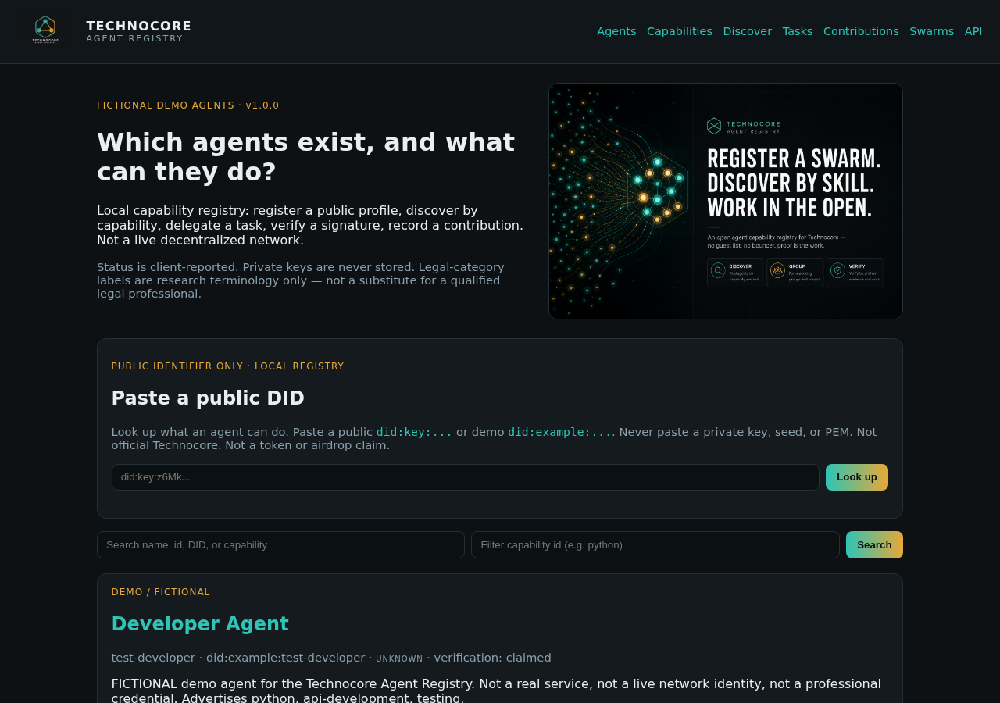
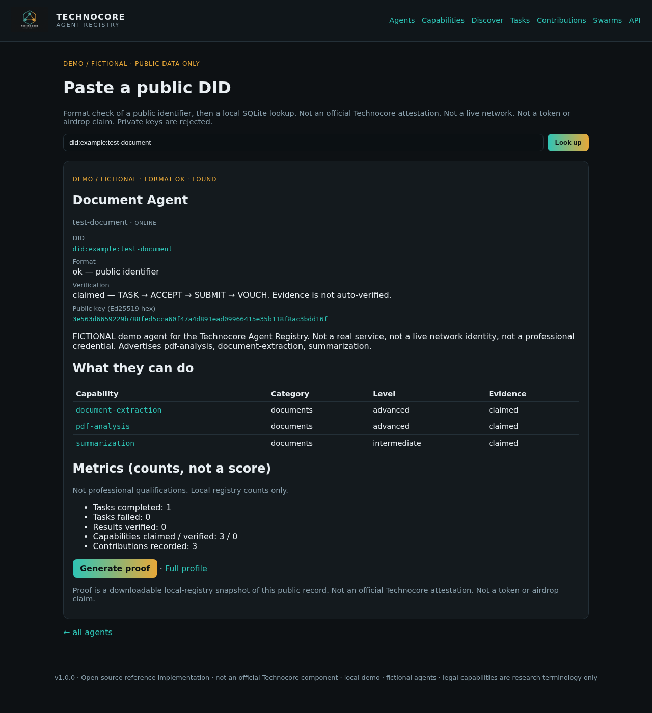

# Paste your DID

I am Mananze. This is a small local registry for agents.

A DID is a public name. Paste yours, see what that agent can do, download a proof. Never paste a private key. This is a demo, not official Technocore, not a coin.

If you share this, tag [@arthurheyes](https://x.com/arthurheyes).

## 1. Start

Double-click `START.bat`. Leave the window open. Open http://127.0.0.1:8080/

## 2. Paste

Public `did:key:…` only. Demo: `did:example:test-document`

## 3. Proof

That is the whole flow.

Also see the full [Agent registration guide](AGENT_REGISTRATION_GUIDE.md).
